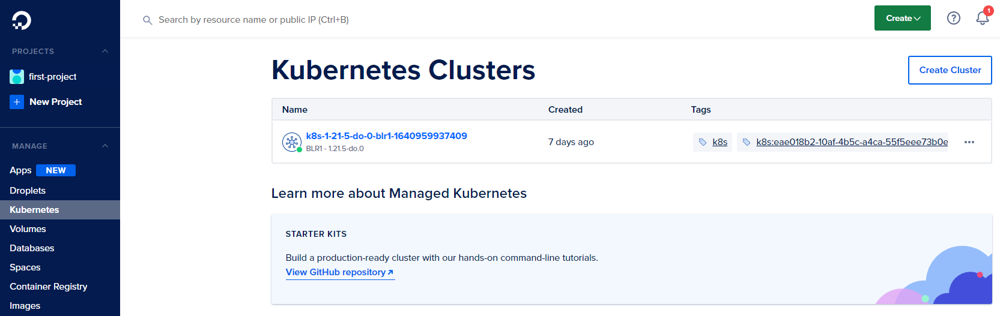
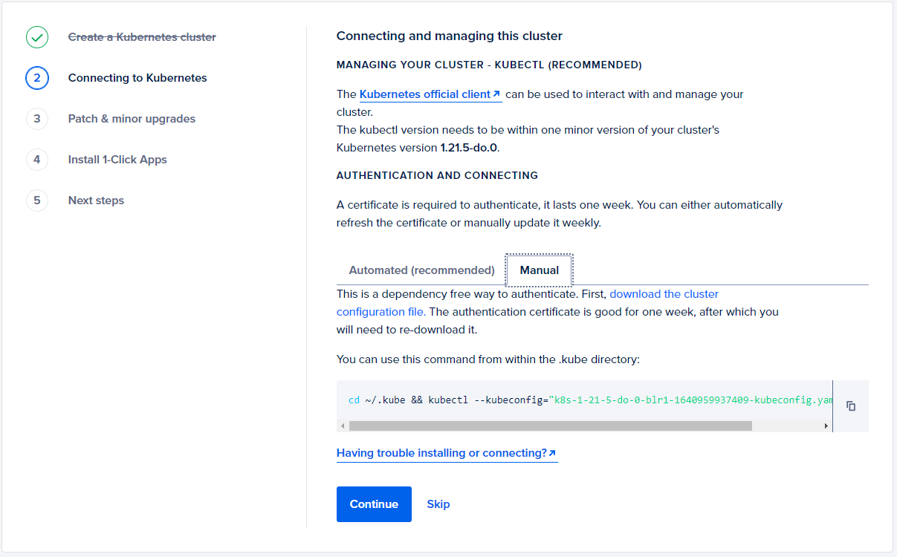
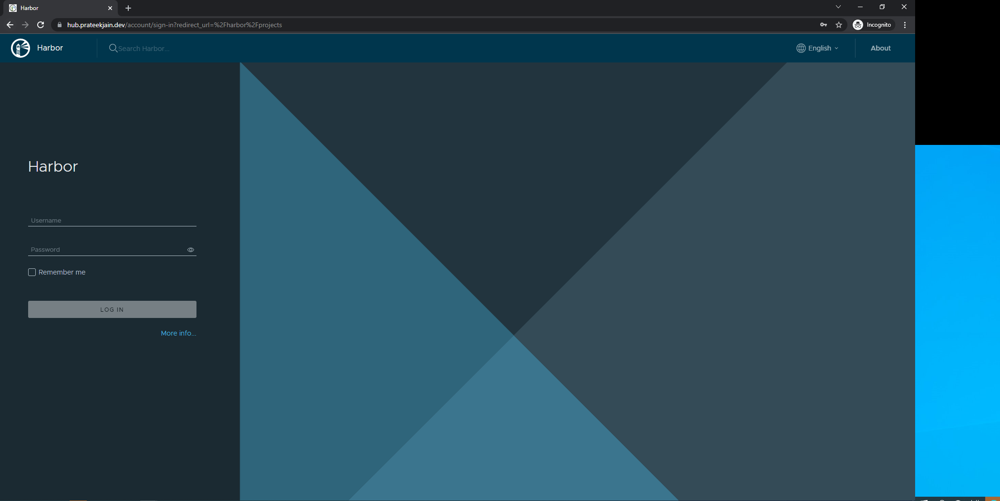

# Harbor Docker Registry in Digital Ocean Kubernetes Cluster

Here are the steps:

## 1. Creating Kubernetes Cluster

First, I created a Kubernetes cluster by referring to this article https://docs.digitalocean.com/products/kubernetes/quickstart/



Once cluster is ready, I downloaded the cluster configuration from the console and added that in my local machine's .kube directory by running this command.



```cd ~/.kube && kubectl --kubeconfig="k8s-1-21-5-do-0-blr1-1640959937409-kubeconfig.yaml" get nodes```

The above command will show the node available in the cluster.


## 2. Install Helm Chart

```helm repo add bitnami https://charts.bitnami.com/bitnami```


I used bitnami helm charts for the installation, but before that I created ```harbor-values.yaml``` with following values:

```
externalURL: https://hub.prateekjain.dev
commonName: 'hub.prateekjain.dev'
```
Other values I kept as it is. 
```helm install harbor bitnami/harbor --values harbor-values.yaml -n harbor --create-namespace```


Now we are ready to install the chart. For that just run these commands:


## 3. Check the namespace, services, and pods

After running the above command I waited for sometime and then ran the following command to check the objects

### Namespaces:

```kubectl get ns```


### Services:

```kubectl get svc```


### Pods:

```kubectl get pod```


# 4. Adding DNS record

For accessing the registry over a domain, I have added the IP of load balancer for my domain i.e. https://hub.prateekjain.dev

# 5. Login to the Harbor

After the DNS propagation I went to my registry URL:



I ran following commnad for getting the default password

``` kubectl get secret --namespace harbor harbor-core-envvars -o jsonpath="{.data.HARBOR_ADMIN_PASSWORD}" | base64 --decode ```


# 6. Creating the Project

I created a project for pushing the docker images


# 7. Login to the registry

```sudo docker login hub.prateekjain.dev```


# 8. Tagging and pushing the image to registry

``` 
docker build -t do-challenge .
sudo docker tag do-challenge:latest hub.prateekjain.dev/do-challenge/do-challenge:latest
sudo docker push hub.prateekjain.dev/do-challenge/do-challenge:latest 
```

